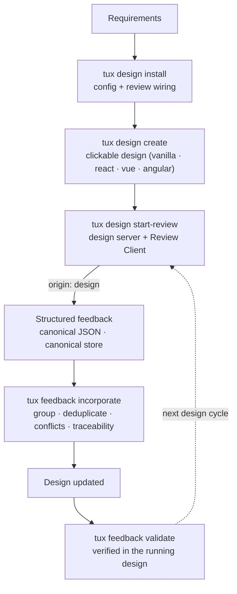
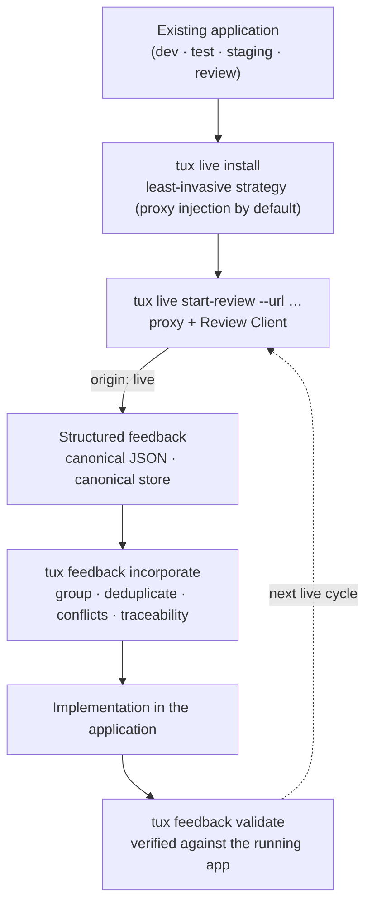
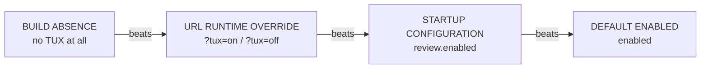

# TUX

[](https://www.npmjs.com/package/tux-uix)
[](https://pypi.org/project/tux-uix/)
[](https://github.com/sommelo1/tux/actions/workflows/ci.yml)
[](https://github.com/sommelo1/tux/actions/workflows/e2e.yml)
[](LICENSE)

**TUX — TUX UIX Review System.** The running UI itself is the review artifact.

Reviewers attach structured, machine-readable feedback directly to running
web interfaces — pages, routes, components, component instances, elements,
and UI states — while humans, CLI tools, scripts, and LLM agents all work
with the same canonical data. No Figma, no annotation boards, no copy-paste
of comments into tickets.

TUX covers **two distinct use cases** — a clickable design world and a live
application world. Both attach structured, machine-readable feedback to the
running UI and share one canonical feedback core (one store, one vocabulary);
they differ in what is reviewed and how the Review Client reaches it.

### Use case 1 — Design review (clickable mockup)

For requirements and design work: screens become runnable, clickable designs
(vanilla, react, vue, angular). TUX is installed into the design environment,
the design is served with the Review Client, and feedback carries
`origin: design`. Incorporation updates the design itself; validation
verifies every change in the running mockup.



### Use case 2 — Live review (running application)

For real applications in development, test, staging, or review environments:
TUX reaches the app without build changes — `tux live install` selects the
least-invasive strategy (reverse-proxy injection by default) and
`tux live start-review --url …` attaches the Review Client through the
proxy. Feedback carries `origin: live`; incorporation drives implementation
in the application's own codebase, and validation verifies against the
running app.



Both cycles use the same feedback verbs — `tux feedback show`, `export`,
`incorporate`, `validate` — scoped with `--origin design|live`, and write
into the same canonical store. Stopping a review server never deletes
feedback.

## Contents

- [Why TUX](#why-tux)
- [Quick start](#quick-start)
- [Installation](#installation)
- [Usage](#usage)
- [Configuration](#configuration)
- [Skills for agents](#skills-for-agents)
- [How it works](#how-it-works)
- [Documentation](#documentation)
- [Repository layout](#repository-layout)
- [Development](#development)
- [License](#license)

## Why TUX

- **Two byte-identical engines.** `js/` (Node ≥ 20, npm `tux-uix`,
  zero runtime dependencies) and `py/` (Python ≥ 3.10, PyPI `tux-uix`,
  stdlib-only) agree byte-for-byte on every fixture in `conformance/`.
  The fixtures are the source of truth — neither implementation may
  drift.
- **One Review Client.** A single Plain-JS ESM overlay
  (`js/client/tux-review.js`) is shared by every framework (vanilla,
  react, vue, angular). Adapters stay thin — overlay, selection,
  markers, CRUD, and schema logic are never reimplemented per framework.
- **Canonical vocabulary.** CLI `tux <domain> <action>` ↔ Skill
  `tux-<domain>-<action>` — one vocabulary across CLI, skills, config,
  docs, and agent workflows. No synonyms.
- **LLM-native.** Skills describe agent workflows around the
  deterministic CLI; feedback stays structured, traceable (stable ULIDs),
  and consumable by machines.
- **Removable.** Complete build-time exclusion: a deployment without TUX
  ships no client, no API, no endpoints. Runtime toggles are never a
  security boundary.
- **Deterministic.** Canonical JSON with fixed key order, deterministic
  ULIDs, frozen exit codes, no locale or host paths in output — identical
  input always produces identical bytes.

## Quick start

```bash
# 1) Install TUX into the current project (creates tux.config.json)
npx --yes --package=tux-uix tux design install --framework vanilla

# 2) Scaffold a runnable multi-route design
npx --yes --package=tux-uix tux design create --framework vanilla --name checkout

# 3) Start the review server
npx --yes --package=tux-uix tux design start-review
# → http://127.0.0.1:4173
```

Review in the browser: click the ⬢ launcher (or press `Alt+T`), pick any
element, leave structured feedback. Then read it back deterministically:

```bash
tux feedback show --status open --format json
tux feedback incorporate --strategy tasks --format json
tux feedback validate --record fb_01M14502C04SWVHV231VZHZ4D6 --result passed --note "verified in browser"
```

For an **existing application** (live review), use the `live` domain
instead — least-invasive by default via reverse-proxy injection:

```bash
pipx install tux-uix
tux live install
tux live start-review --url http://localhost:3000
```

## Installation

| Engine | Requirement | Install | Entry point |
|---|---|---|---|
| Node | ≥ 20 | `npm install -g tux-uix` or `npx --yes --package=tux-uix tux …` | `tux` |
| Python | ≥ 3.10, stdlib-only | `pipx install tux-uix` or `pip install tux-uix` | `tux` |

Both engines implement the identical CLI and the identical conformance
contract — pick either, or use both (they write the same canonical store).

## Usage

The CLI follows one grammar: `tux <domain> <action>`.

```text
tux design    install | create | start-review | status | stop-review
tux live      install | create | start-review | status | stop-review
tux feedback  show | create | update | delete | clear | export | incorporate | validate
```

- **`design`** — the clickable mockup world: install TUX into a design
  environment, scaffold designs from requirements, serve them with the
  Review Client, manage the server lifecycle.
- **`live`** — the running application world: install TUX into an
  existing app, scaffold live review apps, proxy-inject the client, manage
  the lifecycle.
- **`feedback`** — the shared review store: survey and inspect items
  (`show` without an ID lists, with an ID prints the full item), mutate
  them, export them, and run the incorporation/validation pipeline.

Every command prints canonical JSON on stdout (or a deterministic text
table in `--format text` mode) and diagnostics on stderr as
`error: <message>` with frozen exit codes
(0 success · 1 general · 2 usage · 3 config · 4 server · 5 auth ·
6 not found · 7 conflict).

Example — feedback created in the browser, read back by the CLI:

```bash
$ tux feedback create --type change --text "The primary CTA should be more prominent." \
    --route /checkout/payment --component PaymentMethodCard --instance visa-ending-1234 \
    --tux-id payment-submit --session review_2026_08_28 --format json
```

```json
{
  "schema_version": "1.0",
  "id": "fb_01M14502C04SWVHV231VZHZ4D6",
  "project_id": "checkout-redesign",
  "session_id": "review_2026_08_28",
  "author": {
    "user_id": "usr_8f3a12",
    "display_name": "Lorenz"
  },
  "origin": {
    "mode": "design"
  },
  "location": {
    "route": "/checkout/payment",
    "component": "PaymentMethodCard",
    "component_instance": "visa-ending-1234"
  },
  "target": {
    "tux_id": "payment-submit"
  },
  "ui_state": {},
  "feedback": {
    "type": "change",
    "text": "The primary CTA should be more prominent."
  },
  "status": "open",
  "created_at": "2026-08-28T12:20:00.000Z",
  "updated_at": "2026-08-28T12:20:00.000Z"
}
```

## Configuration

`tux.config.json` in the project root (override per invocation with
`--config` or `TUX_CONFIG`; precedence: CLI flags → environment → config
file → defaults):

```json
{
  "project_id": "checkout-redesign",
  "design": {
    "root": "requirements",
    "framework": "vanilla"
  },
  "review": {
    "enabled": true,
    "store": ".tux/feedback.json",
    "host": "127.0.0.1",
    "port": 4173
  },
  "identity": {
    "provider": "local",
    "user_id": "anonymous",
    "display_name": "Anonymous",
    "admins": []
  }
}
```

`tux design install` and `tux live install` create this file with the
canonical defaults. Identity may come from local config, environment, or
application authentication (`identity.provider`).

Environment overrides (each beats the config file, CLI flags beat the
environment): `TUX_CONFIG`, `TUX_PROJECT_ID`, `TUX_STORE`, `TUX_HOST`,
`TUX_PORT`, `TUX_USER_ID`, `TUX_DISPLAY_NAME`.

## Skills for agents

Eleven canonical skills in `skills/` describe agent workflows 1:1 on the
CLI — the naming rule is `tux <domain> <action>` ↔ `tux-<domain>-<action>`:

| Phase | Skills |
|---|---|
| Install | `tux-design-install` · `tux-live-install` |
| Create | `tux-design-create` · `tux-live-create` |
| Start review | `tux-design-start-review` · `tux-live-start-review` |
| Incorporate (incl. verification) | `tux-design-incorporate` · `tux-live-incorporate` |
| Feedback read/cleanup | `tux-feedback-show` · `tux-feedback-delete` · `tux-feedback-export` |

The skills are deployed verbatim to `.claude/skills/`, `.hermes/skills/`,
`.kilo/skills/`, `js/skills/`, and `py/tux/skills/` by
`node tools/sync-artifacts.mjs` — edit the canonical source, regenerate,
never patch a deployed copy. Both test suites enforce byte-identity.

## How it works

**Activation** — four layers with normative precedence (SPC sections
62–70):



A build without TUX contains no client, no bootstrap, no API endpoints —
`?tux=on` on such a build changes nothing. Runtime disabling is a
convenience, not a security boundary.

**Review Client** — one Plain-JS ESM module (`tux-review.js` +
`tux-review.css`), injected by the TUX server or loaded directly. It
scopes itself to elements carrying `data-tux-ui`, captures bounded UI
state (modals, drawers, tabs), resolves targets via fingerprints
(`data-tux-id` / `data-tux-component` / `data-tux-instance`), and is
SPA-route-aware.

**Persistence** — feedback lives in the canonical store
(`.tux/feedback.json` by default) with sessions and incorporation
batches alongside. Stopping a review server never deletes feedback.

## Documentation

- [`SPC.md`](SPC.md) — the normative specification (94 sections): schema,
  taxonomy, activation, security, conformance, skills, MVP scope.
- [`conformance/README.md`](conformance/README.md) — how the byte-identical
  behavior fixtures work and the determinism contract
  (ULIDs, canonical JSON, `TUX_TIME_OVERRIDE`).
- [`AGENTS.md`](AGENTS.md) — the duality contract and the rules coding
  agents must follow in this repository.

## Repository layout

```text
SPC.md            normative specification
conformance/      byte-identical behavior fixtures (source of truth)
skills/           canonical skill sources → deployed to .claude/.hermes/.kilo/js/py
js/               npm package: CLI, server, Review Client, tests, Playwright E2E
py/               PyPI package: CLI + server (stdlib-only), pytest suite
tools/            gen-case-inputs, gen-expected, sync-artifacts, packaging, release
examples/         runnable vanilla design used by the E2E suite
```

## Development

```bash
cd js && npm test          # conformance + server API + review lifecycle + skills
cd js && npm run e2e       # Playwright: activation matrix, CRUD, SPA, persistence
.venv/Scripts/python.exe -m pytest py/tests -q   # Python mirror (via repo .venv)
```

Packaging and release — artifacts are built, content-inspected and verified
in dedicated environments (fresh `npm install` of the tarball, fresh venv
with the wheel, real react/vue/angular production builds served over HTTP):

```bash
node tools/package-js.mjs            # npm tarball → dist/ + inspection
node tools/package-py.mjs            # sdist + wheel → dist/ + inspection
node tools/install-test.mjs          # dedicated-env installation verification
node tools/release.mjs <x.y.z>       # bump + tests + packaging + install-test + tag/push
```

CI runs the same gates on every push/PR (ubuntu + windows): JS tests,
Python tests, packaging inspection, dedicated-environment install test
and the Playwright suite. Tagged releases (`v*`) publish to npm and PyPI
via GitHub Actions (`.github/workflows/`).

## License

MIT — see [LICENSE](LICENSE).
