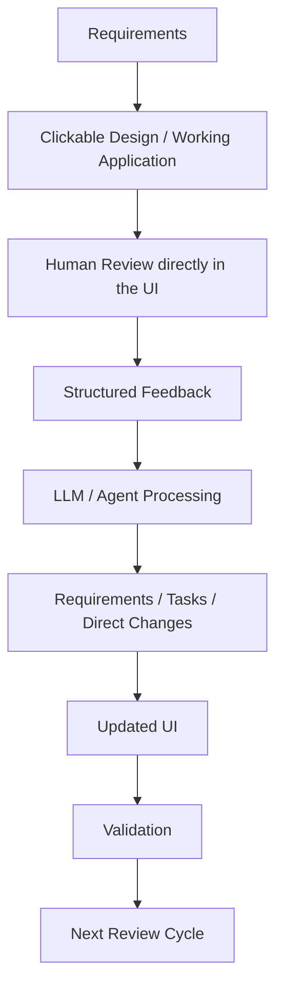
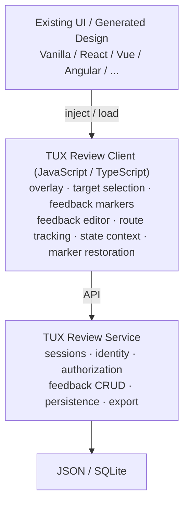
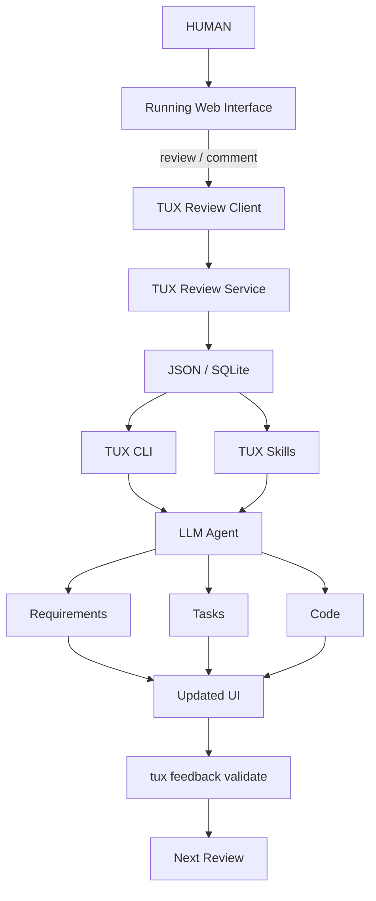

# TUX UIX Review Specification (SPC)

Normative specification of **TUX — TUX UIX Review System**. The running UI itself is the review artifact.

The canonical implementations are `js/` (npm `tux-uix`, Node ≥ 20) and `py/` (PyPI `tux-uix`, Python ≥ 3.10, stdlib-only). The byte-identical behavior fixtures under `conformance/` are the source of truth for cross-runtime behavior.

The key words **MUST**, **SHOULD**, **MAY** are to be interpreted as described in [RFC 2119](https://www.rfc-editor.org/rfc/rfc2119).

## Table of Contents

**Purpose and Intent** — [1. Purpose](#1-purpose) · [2. Core Intent](#2-core-intent)

**Canonical Vocabulary** — [3. Canonical Vocabulary Principle](#3-canonical-vocabulary-principle) · [4. Canonical Domains](#4-canonical-domains) · [5. Canonical Actions](#5-canonical-actions)

**Principles, Goals, Non-Goals** — [6. Design Principles](#6-design-principles) · [7. Goals](#7-goals) · [8. Non-Goals](#8-non-goals)

**Architecture and Environments** — [9. Core Architecture](#9-core-architecture) · [10. Supported Environments](#10-supported-environments)

**Review Client** — [11. Review Client](#11-review-client) · [12. Review Client Capabilities](#12-review-client-capabilities) · [13. Multi-Page Feedback](#13-multi-page-feedback) · [14. Feedback Context Model](#14-feedback-context-model) · [15. UI State](#15-ui-state) · [16. Element Identification](#16-element-identification) · [17. Feedback Schema](#17-feedback-schema)

**Feedback Model and Ecosystems** — [18. Origin](#18-origin) · [19. Feedback Types](#19-feedback-types) · [20. Feedback Status](#20-feedback-status) · [21. Identity](#21-identity) · [22. Persistence](#22-persistence) · [23. Server](#23-server) · [24. Language Ecosystems](#24-language-ecosystems)

**CLI, Skills, Integration Selection** — [25. CLI Taxonomy](#25-cli-taxonomy) · [26. Skill Taxonomy](#26-skill-taxonomy) · [27. Integration Selection](#27-integration-selection)

**Design and Live Domains** — [28. `tux design install`](#28-tux-design-install) · [29. Design Integration Discovery](#29-design-integration-discovery) · [30. Design Integration Responsibilities](#30-design-integration-responsibilities) · [31. Design Integration Acceptance](#31-design-integration-acceptance) · [32. `tux live install`](#32-tux-live-install) · [33. Review Integration Discovery](#33-review-integration-discovery) · [34. Review Integration Strategy](#34-review-integration-strategy) · [35. Framework Adapter Boundary](#35-framework-adapter-boundary) · [36. `tux design create`](#36-tux-design-create) · [37. Design Creation Workflow](#37-design-creation-workflow) · [38. `tux design start-review`](#38-tux-design-start-review) · [39. `tux live start-review`](#39-tux-live-start-review) · [40. `tux live status`](#40-tux-live-status) · [41. `tux live stop-review`](#41-tux-live-stop-review)

**Feedback Commands** — [42. `tux feedback show`](#42-tux-feedback-show) · [43. Reserved](#43-reserved) · [44. `tux feedback create`](#44-tux-feedback-create) · [45. `tux feedback update`](#45-tux-feedback-update) · [46. `tux feedback delete`](#46-tux-feedback-delete) · [47. `tux feedback clear`](#47-tux-feedback-clear) · [48. `tux feedback export`](#48-tux-feedback-export)

**Incorporation and Validation** — [49. `tux feedback incorporate`](#49-tux-feedback-incorporate) · [50. Feedback Incorporation Workflow](#50-feedback-incorporation-workflow) · [51. Incorporation Methodology](#51-incorporation-methodology) · [52. Incorporation Scope](#52-incorporation-scope) · [53. Duplicate Feedback](#53-duplicate-feedback) · [54. Conflicting Feedback](#54-conflicting-feedback) · [55. Traceability](#55-traceability) · [56. `tux feedback validate`](#56-tux-feedback-validate) · [57. Validation Workflow](#57-validation-workflow)

**Sessions and SPA** — [58. Review Sessions](#58-review-sessions) · [59. SPA Navigation](#59-spa-navigation) · [60. Dynamic Components](#60-dynamic-components) · [61. Application Isolation](#61-application-isolation)

**Activation Model** — [62. Activation Model](#62-activation-model) · [63. Build-Time Inclusion](#63-build-time-inclusion) · [64. Default Activation](#64-default-activation) · [65. Startup Configuration](#65-startup-configuration) · [66. Runtime URL Override](#66-runtime-url-override) · [67. Activation Precedence](#67-activation-precedence) · [68. Runtime Persistence of URL Override](#68-runtime-persistence-of-url-override) · [69. URL Parameter Safety](#69-url-parameter-safety) · [70. Security Meaning of Activation](#70-security-meaning-of-activation)

**Security** — [71. Recommended Environment Policy](#71-recommended-environment-policy) · [72. Security Principle](#72-security-principle) · [73. Authorization](#73-authorization)

**CLI, Configuration, Layout** — [74. Machine-Readable CLI](#74-machine-readable-cli) · [75. Exit Codes](#75-exit-codes) · [76. Configuration](#76-configuration) · [77. Suggested Project Layout](#77-suggested-project-layout) · [78. Integration Selection Workflow](#78-integration-selection-workflow)

**Skills** — [79. Skill: `tux-design-install`](#79-skill-tux-design-install) · [80. Skill: `tux-live-install`](#80-skill-tux-live-install) · [81. Skill: `tux-design-create`](#81-skill-tux-design-create) · [82. Skill: `tux-live-start-review`](#82-skill-tux-live-start-review) · [83. Skill: `tux-design-incorporate`](#83-skill-tux-design-incorporate) · [84. Skill: `tux-live-incorporate`](#84-skill-tux-live-incorporate)

**Tests and Scenarios** — [85. Required Integration Tests](#85-required-integration-tests) · [86. Verification Procedure](#86-verification-procedure) · [87. Integration Acceptance](#87-integration-acceptance) · [88. Design Acceptance Scenario](#88-design-acceptance-scenario) · [89. Live Review Acceptance Scenario](#89-live-review-acceptance-scenario) · [90. Feedback Incorporation Scenario](#90-feedback-incorporation-scenario) · [91. Validation Scenario](#91-validation-scenario)

**Scope and System Model** — [92. MVP Scope](#92-mvp-scope) · [93. Canonical System Model](#93-canonical-system-model) · [94. Final Normative Principles](#94-final-normative-principles)

---

## 1. Purpose

TUX is a lightweight, framework-agnostic UI review system for two primary use cases:

1. clickable UI/UX mockups created during design and requirements work;
2. existing web applications running in development, test, staging, review, or other controlled environments.

The core principle is:

> The running UI itself is the review artifact.

Reviewers interact directly with the rendered and clickable interface and attach feedback to pages, routes, components, component instances, individual UI elements, dialogs, tabs, and relevant UI states.

Feedback is persisted as structured, machine-readable data so that humans, scripts, CLI tools, and LLM-based coding agents can reliably retrieve, interpret, consolidate, incorporate, and validate requested changes.

TUX must not depend on Figma or another proprietary design platform.

## 2. Core Intent

TUX closes the loop between requirements, clickable UI design, human review, implementation, and verification.



TUX is explicitly designed to be:

```text
human-friendly
+
machine-friendly
+
LLM-friendly
```

Humans primarily interact through the rendered UI.

Automation and agents primarily interact through:

```text
CLI
+
Canonical JSON
+
TUX Skills
```

## 3. Canonical Vocabulary Principle

TUX must use one canonical vocabulary across:

* CLI commands;
* Skills;
* configuration;
* documentation;
* feedback schema;
* agent instructions;
* integration guides;
* test specifications.

A concept must not receive different names depending on the interface.

The canonical command grammar is:

```text
tux <domain> <action> [arguments] [options]
```

The corresponding Skill name is the hyphenated form of the same canonical path.

Example:

```text
CLI:
tux design install
Skill:
tux-design-install
```

```text
CLI:
tux feedback export
Skill:
tux-feedback-export
```

Therefore:

> CLI paths and Skill names must use the same nouns and verbs wherever they represent the same capability.

## 4. Canonical Domains

Initial canonical TUX domains are:

```text
tux design$1tux live$2tux feedback
tux design$1tux live$2tux feedback
tux design$1tux live$2tux feedback
```

Future domains may be introduced only if they represent a genuinely distinct concept.

Potential examples:

```text
tux session
tux config
```

The taxonomy should remain deliberately small.

## 5. Canonical Actions

Actions should use a consistent verb vocabulary.

Examples:

```text
integrate
create
serve
start
stop
status
show
update
delete
clear
export
incorporate
validate
```

Different words should not be used for the same operation.

For example, TUX should not inconsistently use:

```text
return
gather
apply
process
```

when the canonical operation is:

```text
incorporate
```

## 6. Design Principles

### 6.1 UI as Review Surface

Feedback is created directly on the actual rendered UI.

TUX should not require:

* screenshots;
* separate annotation boards;
* external design tools;
* manual copying of comments into development tasks.

### 6.2 Clickable Designs

Designs are real runnable web interfaces rather than static pictures.

A TUX design may contain:

* multiple pages;
* routes;
* menus;
* tabs;
* modals;
* drawers;
* forms;
* navigation;
* realistic interaction states.

### 6.3 Structured Feedback

Feedback is not merely free text.

Each item should contain enough technical context for an agent to understand:

* where the feedback belongs;
* which UI target it refers to;
* which route was active;
* which component was involved;
* which component instance was involved;
* which relevant UI state existed;
* who created it;
* what was requested;
* whether it has been incorporated;
* whether the resulting change has been validated.

### 6.4 CLI as Stable Machine Interface

All relevant operations shall have deterministic CLI interfaces.

Humans may use the browser UI.

Agents should not need to automate the visual review interface in order to retrieve feedback.

### 6.5 Skills as Workflow Contracts

Skills describe how an LLM or coding agent should perform higher-level TUX workflows.

The distinction is:

```text
CLI
= executable operations
Skills
= workflow instructions using those same canonical concepts
```

The vocabulary remains identical.

### 6.6 Framework Agnostic

The browser-side review functionality should be shared across frameworks.

Framework-specific adapters must remain thin.

### 6.7 Removable Review Functionality

TUX must support complete build-time exclusion.

A deployment that does not require TUX should be able to ship no TUX code or endpoints at all.

## 7. Goals

TUX shall provide:

* clickable browser-based designs;
* direct feedback on rendered UI;
* multi-page review;
* multi-route review;
* component-level feedback;
* component-instance-level feedback;
* element-level feedback;
* state-aware feedback;
* feedback persistence;
* framework-independent browser behavior;
* Vanilla HTML/JavaScript support;
* React support;
* Vue support;
* Angular support;
* extensibility to additional frameworks;
* Python ecosystem integration;
* JavaScript/TypeScript ecosystem integration;
* deterministic CLI operations;
* canonical JSON output;
* versioned schemas;
* LLM-friendly Skills;
* integration verification;
* traceability;
* runtime activation controls;
* startup configuration;
* URL runtime override;
* complete build-time exclusion.

## 8. Non-Goals

TUX is not intended to become:

* a full vector graphics design tool;
* a generic issue tracker;
* a project-management system;
* a production analytics platform;
* a browser automation framework;
* a source-control replacement;
* a requirements database;
* a general bug tracker.

TUX focuses on:

```text
UI
→ Review
→ Structured Feedback
→ Incorporation
→ Validation
```

## 9. Core Architecture



## 10. Supported Environments

### 10.1 Design

TUX shall support clickable designs built with at minimum:

```text
Vanilla HTML/CSS/JavaScript
React
Vue
Angular
```

Generated designs should live inside or near the requirements they represent.

Example:

```text
requirements/
└── checkout/
    ├── requirements.md
    └── design/
        ├── package.json
        ├── src/
        └── ...
```

### 10.2 Live Review

TUX shall support review of existing web applications running in:

```text
development
test
review
staging
```

and optionally other environments where deliberately enabled.

Typical supported targets:

```text
Static HTML
Vanilla JS
React
Vue
Angular
```

Further frameworks may be supported through adapters.

## 11. Review Client

The TUX Review Client is a shared JavaScript/TypeScript browser library.

It overlays review functionality onto the existing UI.

It must not become coupled to the business-domain logic of the target application.

## 12. Review Client Capabilities

A reviewer must be able to:

* select a page, component, or element;
* create feedback;
* inspect feedback;
* update their own feedback;
* delete individual feedback they own;
* clear all feedback they own within scope;
* navigate through the application;
* return to previously reviewed routes;
* see the appropriate markers restored.

Authorized users may additionally:

* delete feedback owned by other users;
* clear all feedback;
* administer review sessions.

## 13. Multi-Page Feedback

Feedback may exist across many pages of one clickable design.

Example:

```text
Landing
→ Product List
→ Product Detail
→ Cart
→ Checkout
→ Confirmation
```

A reviewer may create independent feedback on every page.

TUX must maintain correct association while navigating.

## 14. Feedback Context Model

Canonical hierarchy:

```text
Review Session
    ↓
Application / Design
    ↓
Route / Page
    ↓
Component
    ↓
Component Instance
    ↓
Element
    ↓
UI State
    ↓
Feedback
```

Not every level is mandatory.

Feedback may apply to:

* the entire design/application;
* a page;
* a reusable component;
* a component instance;
* an element;
* an element in a particular state.

## 15. UI State

Route alone is insufficient for modern applications.

Example:

```text
/dashboard
/dashboard with Analytics tab
/dashboard with modal open
/dashboard with filter=crypto
```

TUX should capture relevant state.

Example:

```json
{
  "tab": "analytics",
  "modal": "add-asset",
  "filter": "crypto"
}
```

TUX must not blindly persist the complete internal application state.

Only relevant, bounded state should be captured.

## 16. Element Identification

TUX should collect multiple independent target-identification signals.

Example:

```json
{
  "target": {
    "tux_id": "checkout-submit",
    "test_id": "checkout-submit",
    "component": "CheckoutActions",
    "role": "button",
    "accessible_name": "Complete purchase",
    "text": "Complete purchase",
    "css_selector": "...",
    "dom_path": "...",
    "bounding_box": {
      "x": 742,
      "y": 611,
      "width": 180,
      "height": 44
    }
  }
}
```

Preferred matching priority:

```text
tux_id
→ test_id
→ component identity
→ role + accessible name
→ stable attributes
→ text
→ CSS selector
→ DOM path
→ coordinates
```

Coordinates are contextual fallback data only.

## 17. Feedback Schema

Feedback must use a versioned canonical schema.

Example:

```json
{
  "schema_version": "1.0",
  "id": "fb_01J6F91H1J8K",
  "project_id": "checkout-redesign",
  "session_id": "review_2026_08_28",
  "author": {
    "user_id": "usr_8f3a12",
    "display_name": "Lorenz"
  },
  "origin": {
    "mode": "design"
  },
  "location": {
    "route": "/checkout/payment",
    "page": "CheckoutPayment",
    "component": "PaymentMethodCard",
    "component_instance": "visa-ending-1234"
  },
  "target": {
    "tux_id": "payment-submit",
    "role": "button",
    "accessible_name": "Continue",
    "text": "Continue"
  },
  "ui_state": {
    "step": 2,
    "payment_method": "credit-card"
  },
  "feedback": {
    "type": "change",
    "text": "The primary CTA should be more prominent."
  },
  "status": "open",
  "created_at": "2026-08-28T12:20:00+02:00",
  "updated_at": "2026-08-28T12:20:00+02:00"
}
```

## 18. Origin

Design and live review use the same schema.

Only metadata differs.

Design:

```json
{
  "origin": {
    "mode": "design"
  }
}
```

Live review:

```json
{
  "origin": {
    "mode": "live"
  }
}
```

The processing logic must remain identical.

## 19. Feedback Types

Canonical initial types:

```text
change
issue
question
approval
```

#### change

Requested modification.

#### issue

Observed problem or incorrect behavior.

#### question

Clarification request.

#### approval

Explicit acceptance of the reviewed target.

## 20. Feedback Status

Initial canonical statuses:

```text
open
incorporated
resolved
rejected
```

Validation metadata may additionally track whether an incorporated change has been verified.

Possible later states:

```text
duplicate
needs-clarification
superseded
```

Deletion is not equivalent to resolution.

## 21. Identity

`--mine` always refers to the stable current user identity.

Example:

```json
{
  "user_id": "usr_8f3a12",
  "display_name": "Lorenz"
}
```

Ownership is based on:

```text
user_id
```

not on:

```text
browser
machine
local file ownership
```

Identity may originate from:

* local TUX configuration;
* CLI identity;
* environment configuration;
* application authentication;
* SSO;
* session-level identity.

## 22. Persistence

TUX shall initially support:

```text
JSON
SQLite
```

### JSON

Suitable for:

* simple designs;
* small teams;
* single-user work;
* Git-visible artifacts.

### SQLite

Preferred for:

* multiple reviewers;
* concurrent writes;
* larger review sets;
* querying;
* lifecycle tracking.

The logical schema must remain independent of the storage backend.

Agents should not directly depend on internal SQLite tables.

## 23. Server

The lightweight TUX service shall provide:

* application/design serving where applicable;
* Review Client injection or delivery;
* feedback API;
* persistence;
* identity;
* authorization;
* review sessions.

## 24. Language Ecosystems

TUX should support both:

```text
JavaScript / TypeScript
Python
```

Recommended responsibility split:

```text
Browser Review Client
→ TypeScript
Schema / protocol
→ JSON
JavaScript integrations
→ JS / TS
Python integrations
→ Python
CLI semantics
→ identical
```

## 25. CLI Taxonomy

Canonical grammar:

```text
tux <domain> <action>
```

Initial canonical command tree:

```text
tux
├── design
│   ├── install
│   ├── create
│   ├── start-review
│   ├── status
│   └── stop-review
│
├── live
│   ├── install
│   ├── create
│   ├── start-review
│   ├── status
│   └── stop-review
│
└── feedback
    ├── show
    ├── create
    ├── update
    ├── delete
    ├── clear
    ├── export
    ├── incorporate
    └── validate
```

## 26. Skill Taxonomy

The corresponding canonical Skills are:

```text
tux-design-install
tux-design-create
tux-design-start-review
tux-live-install
tux-live-create
tux-live-start-review
tux-design-incorporate
tux-live-incorporate
```

Skills need not exist for every trivial CLI primitive.

For example, a dedicated Skill is not necessarily required for:

```text
tux live status
tux feedback clear
```

The naming rule remains:

```text
tux <domain> <action>
↔
tux-<domain>-<action>
```

## 27. Integration Selection

There is no separate global `tux-integrate` Skill.

When integration is requested, the agent asks:

```text
Which TUX integration do you need?
1. Design
2. Live review
3. Design and live review
```

Selection mapping:

```text
Design
→ tux design install
→ tux-design-install
```

```text
Live review
→ tux live install
→ tux-live-install
```

```text
Both
→ tux design install
→ tux live install
```

No additional integration abstraction is required.

## 28. `tux design install`

Canonical CLI:

```bash
tux design install
```

Canonical Skill:

```text
tux-design-install
```

Purpose:

Integrate TUX into the clickable design environment of the current project.

## 29. Design Integration Discovery

The integration must determine:

* project runtime;
* design framework;
* package manager;
* build tool;
* design location;
* development server;
* router;
* configuration mechanism;
* persistence mechanism;
* test infrastructure.

## 30. Design Integration Responsibilities

`tux design install` shall establish:

* TUX Review Client;
* design review service;
* feedback API;
* persistence;
* reviewer identity;
* route tracking;
* component targeting;
* marker restoration;
* activation rules;
* required tests;
* integration verification.

## 31. Design Integration Acceptance

Integration is successful only if a reviewer can:

* start the design;
* navigate across multiple pages;
* create feedback on multiple routes;
* create feedback on components;
* create feedback on component instances;
* reload;
* recover feedback;
* retrieve the same feedback through CLI.

## 32. `tux live install`

Canonical CLI:

```bash
tux live install
```

Canonical Skill:

```text
tux-live-install
```

Purpose:

Integrate TUX into an existing runnable web application.

`tux live create` scaffolds a runnable live application (vanilla, react, vue or angular) using the same templates as `tux design create`. The artifact is identical; the report declares `"kind": "live"` and the next steps reference `tux live install` and `tux live start-review`. Feedback gathered from it carries `"origin": "live"`.

## 33. Review Integration Discovery

The Skill shall determine:

```text
runtime
framework
framework version
build system
development server
production build process
router
SPA vs multi-page
middleware
proxy setup
configuration system
test framework
```

Potential environments include:

```text
Vanilla JS
React
Next.js
Vue
Nuxt
Angular
Svelte
SvelteKit
Vite
Webpack
FastAPI
Flask
Django
```

Unsupported setups must be reported explicitly.

## 34. Review Integration Strategy

The least invasive valid mechanism should be selected.

Potential strategies:

```text
script injection
reverse proxy injection
development middleware
framework plugin
development server plugin
template injection
bootstrap import
```

The public behavior must remain identical.

## 35. Framework Adapter Boundary

Framework adapters should primarily handle:

```text
loading
routing hooks
development server integration
build-time inclusion
build-time exclusion
```

They should not reimplement:

```text
feedback markers
target selection
feedback editor
CRUD behavior
feedback schema
identity semantics
session semantics
URL runtime override
target fingerprinting
```

## 36. `tux design create`

CLI:

```bash
tux design create
```

Skill:

```text
tux-design-create
```

Purpose:

Create or update a clickable design from project requirements.

Example:

```bash
tux design create --framework react
```

Supported framework values should initially include:

```text
vanilla
react
vue
angular
```

## 37. Design Creation Workflow

Canonical conceptual flow:

```text
read requirements
↓
identify screens
↓
identify routes
↓
identify components
↓
identify interactions
↓
identify UI states
↓
create clickable design
↓
ensure TUX integration
↓
run
↓
verify
```

## 38. `tux design start-review`

CLI:

```bash
tux design start-review
```

Skill where needed:

```text
tux-design-start-review
```

Purpose:

Serve the clickable design with TUX review functionality.

Examples:

```bash
tux design start-review --port 4173
```

```bash
tux design start-review --session checkout-review
```

`tux design start-review` starts the design server detached, writes the server state file and returns. `tux design status` and `tux design stop-review` manage that state with the same semantics as `tux live status` and `tux live stop-review`; `--foreground` keeps the blocking behavior.

## 39. `tux live start-review`

CLI:

```bash
tux live start-review
```

Skill:

```text
tux-live-start-review
```

Purpose:

Start a review-capable instance of an existing application.

Examples:

```bash
tux live start-review --url http://localhost:3000
```

or:

```bash
tux live start-review -- npm run dev
```

## 40. `tux live status`

```bash
tux live status
```

Returns information including:

* current review session;
* application URL;
* target environment;
* active/inactive TUX state;
* feedback count;
* persistence backend;
* connected reviewers where available.

## 41. `tux live stop-review`

```bash
tux live stop-review
```

Stops the TUX-managed review environment.

It must not delete feedback.

## 42. `tux feedback show`

```bash
tux feedback show [feedback-id]
```

Purpose:

Read and inspect feedback.

It performs no semantic incorporation.

Without a feedback ID it surveys feedback. The survey accepts composing filters:

```bash
tux feedback show --status open
```

```bash
tux feedback show --mine
```

```bash
tux feedback show --route /checkout
```

```bash
tux feedback show --session review-2026-08-28
```

Machine-readable:

```bash
tux feedback show --format json
```

With a feedback ID it returns the complete canonical feedback item. The ID mode always prints canonical JSON, ignores `--format` and the survey filters. An unknown ID fails with exit code 6.

## 43. Reserved

Merged into section 42: survey and single-item lookup are one action (`tux feedback show`).

## 44. `tux feedback create`

```bash
tux feedback create
```

Primarily used by the browser Review Client, but exposed as a primitive operation.

## 45. `tux feedback update`

```bash
tux feedback update <feedback-id>
```

Updates an authorized feedback item.

## 46. `tux feedback delete`

```bash
tux feedback delete <feedback-id>
```

Deletes one explicit feedback item.

Authorization applies.

## 47. `tux feedback clear`

Own feedback:

```bash
tux feedback clear --mine
```

Definition:

```text
author.user_id == current_user.user_id
```

Optional scope:

```bash
tux feedback clear --mine --route /checkout
```

```bash
tux feedback clear --mine --session review-2026-08-28
```

All feedback:

```bash
tux feedback clear --all
```

This requires authorization and explicit confirmation.

Non-interactive execution:

```bash
tux feedback clear --all --force
```

`--all` must never be assumed implicitly.

## 48. `tux feedback export`

```bash
tux feedback export
```

Purpose:

Serialize feedback without interpretation.

Examples:

```bash
tux feedback export --format json
```

```bash
tux feedback export --format jsonl
```

Canonical semantic distinctions:

```text
show
= inspect
export
= serialize
incorporate
= process into development workflow
validate
= verify implementation against feedback
clear
= delete
```

## 49. `tux feedback incorporate`

CLI:

```bash
tux feedback incorporate
```

Skill:

```text
tux-design-incorporate
```

Purpose:

Incorporate unresolved feedback into the development process.

## 50. Feedback Incorporation Workflow

Canonical flow:

```text
load feedback
↓
validate schema
↓
group by route/component
↓
identify duplicates
↓
identify conflicts
↓
preserve feedback IDs
↓
choose methodology
↓
requirements / tasks / direct changes
↓
record traceability
```

Feedback must not be silently deleted after incorporation.

## 51. Incorporation Methodology

When interactive, TUX may ask:

```text
How should the feedback be incorporated?
1. Consolidate first
2. Update requirements
3. Create implementation tasks
4. Apply actionable changes directly
5. Review conflicts first
6. Export only
```

Non-interactive:

```bash
tux feedback incorporate --strategy consolidate
```

```bash
tux feedback incorporate --strategy requirements
```

```bash
tux feedback incorporate --strategy tasks
```

```bash
tux feedback incorporate --strategy direct
```

## 52. Incorporation Scope

Default:

```bash
tux feedback incorporate
```

means:

> Incorporate all open feedback in the current review scope.

It does not mean `--mine`.

Optional:

```bash
tux feedback incorporate --mine
```

```bash
tux feedback incorporate --route /checkout
```

```bash
tux feedback incorporate --session review-2026-08-28
```

## 53. Duplicate Feedback

Original items must always remain traceable.

Example:

```text
Consolidated request:
Increase prominence of checkout CTA
Sources:
- fb_A
- fb_B
- fb_C
```

TUX must not destructively merge the originals.

## 54. Conflicting Feedback

Conflicting requests must be surfaced.

Example:

```json
{
  "type": "feedback_conflict",
  "feedback_ids": [
    "fb_A",
    "fb_B"
  ],
  "requires_decision": true
}
```

An LLM must not arbitrarily resolve explicit contradictions unless the chosen methodology gives it authority to do so.

## 55. Traceability

Requirements, tasks, and direct implementation changes must preserve source feedback IDs.

Example:

```text
Requirement UX-143
Origin:
- fb_01J6F91H1J8K
- fb_01J6F91M123A
```

## 56. `tux feedback validate`

CLI:

```bash
tux feedback validate
```

Skill:

```text
tux-live-incorporate
```

Purpose:

Verify whether incorporated changes actually satisfy the originating feedback.

## 57. Validation Workflow

Canonical flow:

```text
feedback IDs
+
changed implementation
↓
run target design/application
↓
navigate to relevant route
↓
restore relevant UI state
↓
identify target
↓
verify requested behavior/change
↓
record result
```

Changing source code alone is not sufficient proof of resolution.

## 58. Review Sessions

Feedback should normally belong to a review session.

Example:

```text
review_2026_08_28_checkout
```

Example schema:

```json
{
  "session_id": "review_2026_08_28_checkout",
  "project_id": "shop",
  "environment": "design",
  "status": "active"
}
```

Environment values may include:

```text
design
development
test
review
staging
```

## 59. SPA Navigation

TUX must support client-side navigation.

Relevant mechanisms include:

```text
History API
hash routing
framework router events
```

Hard reloads must not be required.

## 60. Dynamic Components

TUX shall support dynamically rendered elements including:

* dialogs;
* drawers;
* menus;
* popovers;
* tabs;
* accordions;
* lazy-loaded components;
* virtualized content.

If a target temporarily disappears, its feedback remains persisted.

## 61. Application Isolation

The Review Client should minimize interference.

It should avoid:

* changing business state unnecessarily;
* polluting global styles;
* hijacking application interaction while inactive;
* storing feedback in business-domain tables unless explicitly configured;
* creating hard framework dependencies.

## 62. Activation Model

TUX has three distinct control layers:

```text
Build-Time Inclusion
        ↓
Startup Configuration
        ↓
Runtime URL Override
```

## 63. Build-Time Inclusion

If TUX is not part of the build:

```text
TUX unavailable
```

Neither configuration nor URL parameters may activate code that does not exist.

A build without TUX should contain:

* no Review Client;
* no TUX bootstrap;
* no review API;
* no feedback endpoints;
* no TUX assets;
* no persistence integration.

## 64. Default Activation

If TUX is included and no explicit setting exists:

```text
enabled = true
```

This is the default for intentionally review-capable environments.

## 65. Startup Configuration

Example:

```json
{
  "review": {
    "enabled": false
  }
}
```

Configuration is evaluated at startup.

Changing the file during runtime does not automatically change the active state.

Therefore:

> Configuration controls initial startup state.

## 66. Runtime URL Override

Canonical query parameter:

```text
?tux=on
?tux=off
```

The URL override acts at runtime.

It has precedence over startup configuration.

Example:

```text
config.enabled=false
?tux=on
→ enabled
```

```text
config.enabled=true
?tux=off
→ disabled
```

## 67. Activation Precedence

Normative precedence:

```text
BUILD ABSENCE
    >
URL RUNTIME OVERRIDE
    >
STARTUP CONFIGURATION
    >
DEFAULT ENABLED
```

Equivalent logic:

```text
if TUX is not deployed:
    unavailable
else if URL override exists:
    use URL override
else if startup config defines state:
    use startup config
else:
    enabled
```

## 68. Runtime Persistence of URL Override

For an SPA:

```text
/dashboard?tux=on
```

may establish:

```text
runtime TUX state = enabled
```

Client-side navigation to:

```text
/settings
```

must not silently disable TUX just because the original query parameter is no longer visible.

A later explicit:

```text
?tux=off
```

may change the runtime state.

## 69. URL Parameter Safety

Canonical values:

```text
on
off
```

Unknown values:

```text
?tux=foo
```

must not be interpreted silently.

They should either:

* be ignored;
* produce a documented warning.

## 70. Security Meaning of Activation

Runtime disabling is not equivalent to removal.

```text
?tux=off
```

still means the TUX code may exist.

Likewise:

```text
enabled=false
```

does not eliminate the deployment attack surface.

Only:

```text
TUX excluded from build
```

removes it.

## 71. Recommended Environment Policy

```text
Design
    included
    enabled by default
Development
    included
    usually enabled
Test
    included
    configurable
Review
    included
    configurable
Staging
    project decision
Production
    recommended build exclusion
```

## 72. Security Principle

Normative rule:

> If TUX review functionality is not required in a deployment, the preferred deployment is one where TUX is not present in the build at all.

## 73. Authorization

Default reviewer permissions:

```text
create feedback
read permitted feedback
update own feedback
delete own feedback
clear own feedback
```

Privileged permissions may include:

```text
read all feedback
delete feedback from others
clear all feedback
manage sessions
```

## 74. Machine-Readable CLI

Read and workflow operations should support:

```bash
--format json
```

Where appropriate:

```bash
--quiet
--no-interactive
```

Machine-readable stdout must not contain decorative terminal prose.

Diagnostics belong on stderr.

## 75. Exit Codes

Initial recommended classes:

```text
0 success
1 general failure
2 invalid arguments
3 configuration error
4 connection/server error
5 authorization error
6 entity not found
7 conflict
```

The final numeric contract must be frozen before release.

## 76. Configuration

Canonical project config:

```text
tux.config.json
```

Example:

```json
{
  "design": {
    "root": "requirements",
    "framework": "react"
  },
  "review": {
    "enabled": true,
    "store": ".tux/review.db",
    "host": "127.0.0.1",
    "port": 4173
  },
  "identity": {
    "provider": "local"
  }
}
```

General configuration precedence:

```text
CLI
→ environment
→ config
→ defaults
```

The URL runtime override remains a special runtime activation control with higher activation precedence.

## 77. Suggested Project Layout

```text
project/
├── requirements/
│   ├── feature-a/
│   │   ├── requirements.md
│   │   └── design/
│   └── feature-b/
│
├── src/
│
├── .tux/
│   ├── review.db
│   ├── sessions/
│   └── exports/
│
└── tux.config.json
```

## 78. Integration Selection Workflow

When a user asks to integrate TUX, the agent asks:

```text
Which TUX integration do you want?
1. Design
2. Live review
3. Design and live review
```

Then:

```text
1
→ tux design install
→ tux-design-install
```

```text
2
→ tux live install
→ tux-live-install
```

```text
3
→ execute both integration workflows
```

There is no global `tux-integrate` Skill.

## 79. Skill: `tux-design-install`

Purpose:

Establish a correct, tested, and accepted TUX design integration.

Workflow:

```text
discover project
↓
detect framework
↓
detect design structure
↓
select integration strategy
↓
integrate Review Client
↓
configure persistence
↓
configure identity/session
↓
implement route awareness
↓
implement activation
↓
implement tests
↓
run
↓
verify
↓
accept
```

## 80. Skill: `tux-live-install`

Purpose:

Establish a correct, tested, and accepted TUX live-review integration.

Workflow:

```text
discover application
↓
detect framework/runtime
↓
detect build system
↓
detect router
↓
choose least-invasive integration
↓
integrate Review Client
↓
configure review service
↓
configure persistence
↓
implement activation controls
↓
implement build exclusion
↓
implement tests
↓
run
↓
verify
↓
security-check
↓
accept
```

## 81. Skill: `tux-design-create`

Purpose:

Create a clickable design from requirements after design capability is available.

Workflow:

```text
read requirements
↓
derive screens
↓
derive routes
↓
derive components
↓
derive UI states
↓
implement clickable design
↓
run
↓
verify navigation
↓
verify review capability
```

## 82. Skill: `tux-live-start-review`

Purpose:

Start and verify a review-capable instance of an existing application.

It should:

* start or attach to the target application;
* activate TUX according to configuration;
* verify the Review Client;
* verify feedback API connectivity;
* return the review URL and session information.

## 83. Skill: `tux-design-incorporate`

Purpose:

Process unresolved feedback using the chosen methodology.

Workflow:

```text
tux feedback show --status open --format json
↓
validate
↓
group
↓
deduplicate
↓
identify conflicts
↓
preserve IDs
↓
incorporate
↓
record traceability
```

## 84. Skill: `tux-live-incorporate`

Purpose:

Verify implementation against originating feedback.

Workflow:

```text
load feedback
↓
start relevant design/application
↓
navigate to target
↓
restore state
↓
verify expected change
↓
record result
```

## 85. Required Integration Tests

Every integration must test at minimum:

### Loading

```text
included
→ loads
excluded
→ does not load
```

### Default Activation

```text
included + no setting
→ enabled
```

### Startup Configuration

```text
enabled=true
→ enabled
enabled=false
→ disabled
```

### URL Runtime Override

```text
config=false + ?tux=on
→ enabled
config=true + ?tux=off
→ disabled
```

### Build Exclusion

```text
TUX absent + ?tux=on
→ unavailable
```

### Feedback Creation

```text
select
→ comment
→ persist
→ reload
→ retrieve
```

### Feedback Editing

Owner can edit existing feedback.

### Feedback Deletion

Verify:

```text
delete one
clear --mine
clear --all
```

### Route Awareness

Feedback remains associated with the correct route.

### SPA Navigation

No hard reload required.

### Component Instance Identity

Feedback on one component instance must not appear on another.

### UI State

Feedback inside modal/tab/drawer must retain sufficient context.

### Persistence

Server/application restart must not remove persisted feedback.

### Machine Interface

```bash
tux feedback show --format json
```

must produce valid canonical JSON.

## 86. Verification Procedure

Compilation alone is not sufficient.

Canonical integration verification:

```text
build
↓
start
↓
activate TUX
↓
exercise UI review
↓
create feedback
↓
reload
↓
verify persistence
↓
navigate routes/states
↓
verify CLI
↓
test config activation
↓
test URL override
↓
test exclusion build
↓
accept
```

## 87. Integration Acceptance

An integration may report:

```text
passed
partial
failed
```

It must not report `passed` when:

* only a dependency was added;
* runtime was not tested;
* feedback persistence failed;
* route tracking failed;
* CLI JSON failed;
* URL precedence failed;
* build exclusion failed;
* the target application was broken.

## 88. Design Acceptance Scenario

Run:

```bash
tux design create --framework react
tux design start-review
```

Reviewer:

1. navigates to `/products`;
2. comments on a component;
3. navigates to `/checkout`;
4. comments on a button;
5. opens a modal;
6. comments inside the modal;
7. reloads;
8. revisits the routes.

All markers must reappear in the correct context.

CLI:

```bash
tux feedback show --format json
```

must return all feedback correctly.

## 89. Live Review Acceptance Scenario

Run:

```bash
tux live start-review -- npm run dev
```

The application remains functional.

TUX allows feedback across routes.

Config:

```json
{
  "review": {
    "enabled": false
  }
}
```

starts TUX disabled.

Then:

```text
?tux=on
```

enables it during runtime.

```text
?tux=off
```

disables it.

A build without TUX must remain unaffected by:

```text
?tux=on
```

## 90. Feedback Incorporation Scenario

A session contains:

```text
27 open feedback items
4 reviewers
7 routes
12 components
```

Agent uses:

```bash
tux feedback show --status open --format json
```

Then the `tux-design-incorporate` Skill:

* groups requests;
* detects duplicates;
* detects conflicts;
* preserves IDs;
* applies the selected methodology;
* updates requirements, tasks, or code;
* keeps traceability.

Feedback is not automatically deleted.

## 91. Validation Scenario

After implementation:

```bash
tux feedback validate
```

or the `tux-live-incorporate` Skill verifies:

* affected route;
* affected component;
* affected instance;
* relevant state;
* expected result.

Only successfully verified feedback may be considered resolved.

## 92. MVP Scope

Initial MVP should provide:

1. Vanilla HTML/JS support;
2. React support;
3. shared TypeScript Review Client;
4. element selection;
5. feedback creation;
6. feedback editing;
7. feedback deletion;
8. `tux feedback clear --mine`;
9. `tux feedback clear --all`;
10. route-aware feedback;
11. component-aware feedback;
12. basic UI-state capture;
13. JSON persistence;
14. SQLite persistence;
15. `tux design install`;
16. `tux design create`;
17. `tux design start-review`;
18. `tux live install`;
19. `tux live start-review`;
20. `tux live status`;
21. `tux live stop-review`;
22. `tux feedback show`;
23. `tux feedback delete`;
24. `tux feedback clear`;
25. `tux feedback export`;
26. `tux feedback incorporate`;
27. `tux feedback validate`;
28. canonical JSON output;
29. config activation;
30. URL runtime override;
31. build-time exclusion;
32. `tux-design-install`;
33. `tux-live-install`;
34. `tux-design-create`;
35. `tux-design-incorporate`;
36. `tux-live-incorporate`;
37. `tux live create`;
38. `tux design status`;
39. `tux design stop-review`;
40. `tux-feedback-show`;
41. `tux-feedback-delete`;
42. `tux-feedback-export`;
43. integration test contracts;
44. acceptance verification.

Vue and Angular should follow using the same contracts.

## 93. Canonical System Model



## 94. Final Normative Principles

### Vocabulary

> TUX uses one canonical vocabulary across CLI, Skills, configuration, documentation, and agent workflows.

### CLI

```text
tux <domain> <action>
```

### Skill Naming

```text
tux <domain> <action>
↔
tux-<domain>-<action>
```

### Integration

```text
Design
→ tux design install
→ tux-design-install
Live Review
→ tux live install
→ tux-live-install
```

There is no separate global integration Skill.

### Feedback Processing

```text
show
→ inspect
export
→ serialize
incorporate
→ integrate feedback into development work
validate
→ verify resulting implementation
clear
→ delete
```

### Activation

```text
BUILD ABSENCE
    >
URL RUNTIME OVERRIDE
    >
STARTUP CONFIGURATION
    >
DEFAULT ENABLED
```

### Security

> If TUX is not required in a deployment, TUX should be excluded from that build.

### Agent Architecture

> CLI operations are deterministic primitives. Skills describe workflows using the exact same canonical vocabulary.

### Review Principle

> The running UI is the review artifact.

### Feedback Principle

> Feedback must remain structured, contextual, persistent, traceable, and consumable by both humans and LLM-based agents.

### Integration Principle

```text
DISCOVER
→ INTEGRATE
→ TEST
→ RUN
→ VERIFY
→ SECURITY-CHECK
→ ACCEPT
```

### Resolution Principle

> A feedback item is not resolved merely because code changed. The resulting UI behavior must be validated against the originating feedback.
